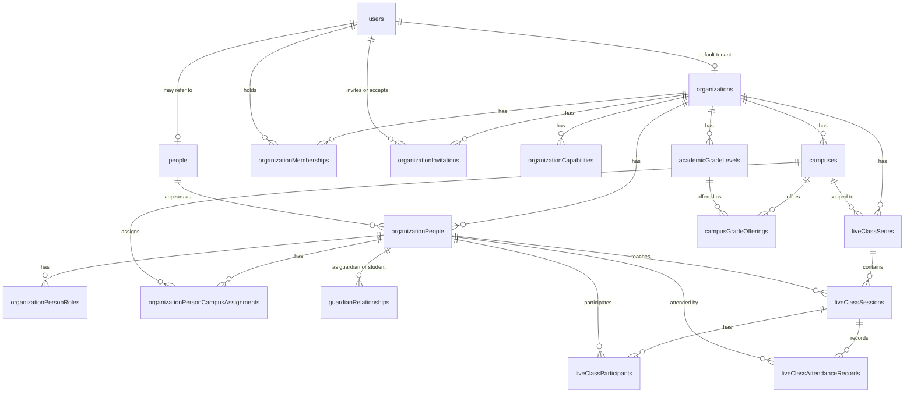

# Convex backend

This directory holds the backend for CPM Studio. It defines tables, invariants, authentication, authorization, and the public function surface that the Next.js frontend consumes.

The backend supports a multi-tenant academic platform. Each tenant is an organization (an institution). An organization may have several campuses, and several capabilities can be enabled on it. People (students, teachers, guardians, staff) live at the institution level, not at the campus level. Capabilities, when enabled, expose business modules; the first such module is `liveClasses`.

This document describes what exists today and why it is shaped that way. It does not propose changes.

## Mental model

The graph of business tables and their canonical relations:



The diagram shows only canonical foreign keys: the relations that define the entity. Several tables also store `organizationId` (and sometimes `campusId`) denormalized for tenant-scoped indexing; those duplicated edges are not drawn here. The "Why we denormalize where we do" section below lists which tables carry such duplicates and why.

`platformInvitations` is omitted because it is platform-level and does not connect to a tenant. Convex Auth's internal tables (`authSessions`, `authAccounts`, etc.) are also omitted; they live behind `@convex-dev/auth` and the project does not interact with them directly.

The schema is best read in this order:

1. `organizations` — the tenant boundary.
2. `campuses` — operational partitions of an organization.
3. `users` — authenticated identities (Convex Auth).
4. `people` — the domain notion of a person, with no login required.
5. `organizationPeople` — affiliation of a person to an organization.
6. `organizationPersonRoles` — domain roles (student, teacher, etc.) for that affiliation.
7. `organizationPersonCampusAssignments` — which campuses a person belongs to.
8. `guardianRelationships` — family ties, scoped to an organization.
9. `organizationMemberships` — administrative access to a tenant.
10. `organizationInvitations` — pending tenant-level team access invitations.
11. `organizationCapabilities` — which modules are enabled for a tenant.
12. `academicGradeLevels` and `campusGradeOfferings` — academic catalog and per-campus offerings.
13. Module tables — currently `liveClassSeries`, `liveClassSessions`, `liveClassParticipants`, `liveClassAttendanceRecords`.

The separation between `users`, `people`, and `organizationPeople` is intentional. A person can exist without a login. A login can refer to a person through `users.personId`. A person may belong to several organizations. Within one organization, a person appears exactly once as an `organizationPerson` and may hold several roles.

## Schema by family

### Tenants and campuses

`organizations` carries `name`, `slug`, optional image, and an active flag. The slug is the subdomain for tenant routing. Each organization is independent of every other.

`campuses` belong to one organization and carry a slug unique within that organization. A campus is an operational partition: primary, secondary, satellite, or a separate jornada. It is not a separate tenant. Capabilities are not enabled at the campus level.

### Users vs people vs organization people

`users` is the Convex Auth users table extended with four project-specific fields:

- `platformRole` — the platform-level role of the user, if any.
- `hasPlatformAccess` — a derived boolean indexed for fast platform-admin lookups.
- `personId` — the optional link to a `people` row.
- `defaultOrganizationId` — the tenant the user lands on by default.

The Convex Auth core fields (`name`, `email`, `phone`, `image`, etc.) are kept as-is because the OAuth provider patches them.

`people` is the domain table of persons. It carries only personal fields: first name, last name, display name, optional avatar. It does not carry `email` or `phone`. Those live in `users` when a login exists.

`organizationPeople` is the join between `people` and `organizations`. One row per (organization, person). It carries an `isActive` flag. The source of truth for campus membership is `organizationPersonCampusAssignments`.

### Domain roles vs administrative access

A person can hold several domain roles within one organization. `organizationPersonRoles` stores those roles: `student`, `teacher`, `guardian`, `staff`, `applicant`. One row per (organization person, role); uniqueness is maintained by the upsert flow in `lib/organizationPeople.ts:upsertOrganizationPersonRole`. The same person can be both teacher and guardian via two rows.

`organizationMemberships` is a separate concept. It records who has administrative access to the organization's dashboard, with a role of `owner`, `admin`, or `member`. A teacher does not need a membership to be a teacher. An admin may have a membership and no `organizationPerson` at all. The two concepts are independent on purpose: one models access, the other models domain identity.

### User activity

`organizationUserActivityDays` stores one daily activity summary per `(organizationId, userId, activityDate)`. It powers profile heatmaps without writing high-churn fields onto `users`, `people`, or `organizationPeople`.

This table is a summary, not a granular event log. The current recorder increments at most once per throttled activity window, so the heatmap shows platform activity density by day while keeping writes bounded.

`organizationPersonActivityDays` stores child/profile-scoped activity summaries per `(organizationId, organizationPersonId, activityDate)`. Guardian sessions can record the selected student profile as context after the backend revalidates the guardian-student relationship. This keeps account-level activity and child-level activity separate without turning children into auth users.

### Campus assignments

`organizationPersonCampusAssignments` links a person to one or more campuses within their organization. One assignment may be marked `isPrimary`. The combination (organizationId, organizationPersonId, campusId) is unique by convention; uniqueness is enforced at write time in `lib/organizationPeople.ts:upsertOrganizationPersonCampusAssignment`.

This table is the only source of truth for campus membership. Do not duplicate primary campus state onto `organizationPeople` unless a measured read path justifies a denormalized digest and the write path keeps both values in sync.

### Guardians and families

`guardianRelationships` links a guardian to a student, both as `organizationPeople`, with a `relationshipType` of `parent`, `mother`, `father`, `guardian`, or `emergency_contact`. Both ends must belong to the same organization. The invariant is enforced in `lib/organizationPeople.ts:upsertGuardianRelationship`.

This table sits at the institution level, not at the campus level. A father can have one child in primary and another in secondary; the relationship does not split by campus.

### Capabilities

`organizationCapabilities` records which platform capabilities are enabled for a tenant, with a `source` of `manual`, `plan`, `trial`, or `override`. The set of valid keys is defined in the project-root file `lib/platform/capabilities.ts` (not in `convex/lib/`) and validated through `capabilityKeyValidator`. Modules query this table through `requireModuleCapability(ctx, slug, key)` to decide whether to allow access.

### Academic catalog

`academicGradeLevels` is an institution-wide catalog of grade levels. One catalog per organization. Each level has a `code`, display `name`, optional `stage`, and `sortOrder`.

`campusGradeOfferings` says which grade levels each campus offers. A primary campus may offer 1st through 5th; a secondary campus may offer 6th through 12th. The catalog avoids duplicating "5th grade" once per campus.

### Platform invitations

`platformInvitations` records pending and historical invitations to the CPM Studio platform itself, not to a specific tenant. An invitation carries a hashed token, an expiration, and a status of `pending`, `accepted`, `expired`, or `revoked`. The Resend integration sends the email from `platform/invitationActions.ts`.

### Organization invitations

`organizationInvitations` records pending and historical invitations to a specific tenant. It is separate from `platformInvitations` because its semantics are different: it grants tenant dashboard membership through `organizationMemberships`, not platform-wide access.

The supported flow is membership-only and powers `/team-settings`, where admins invite team members scoped to the institution. The Resend integration sends the email from `platform/organizationInvitationActions.ts`, and the public `/invite` route resolves whether a token belongs to `platformInvitations` or `organizationInvitations`.

On acceptance, the invitation may create or upgrade `organizationMemberships`, but it never downgrades an existing higher role. Person-account linking is not handled through invitations; academic account creation provisions the related `users.personId` directly.

### Module tables

The schema appends business module tables via `composeModuleTables(...)` at the bottom of `schema.ts`. Today only `liveClasses` is registered, with four tables:

- `liveClassSeries` — a recurring class container, scoped to one organization and one campus.
- `liveClassSessions` — instances of a series, with status `scheduled`, `live`, `ended`, or `canceled`.
- `liveClassParticipants` — who is allowed to join (teacher or student).
- `liveClassAttendanceRecords` — who actually joined; status is `present` only, recorded with `firstJoinedAt`.

The teacher of a session is recorded both on `liveClassSessions.teacherOrganizationPersonId` and as a participant. The two must agree, and the rule is enforced in `modules/liveClasses/lib/model.ts:upsertLiveClassParticipant`.

## Why we denormalize where we do

Convex has no foreign keys and no SQL constraints. Every cross-table invariant lives in a helper. Five tables denormalize `organizationId` even though it could be derived through a join:

- `organizationPersonRoles` (derivable via `organizationPersonId`)
- `guardianRelationships` (derivable via either party)
- `organizationPersonCampusAssignments` (derivable via `organizationPersonId` or `campusId`)
- `campusGradeOfferings` (derivable via `campusId` or `gradeLevelId`)
- `organizationUserActivityDays` (derivable via `userId` and memberships, but activity is tenant-scoped)
- `organizationPersonActivityDays` (derivable from the selected profile context, but tenant-scoped profile activity needs indexed reads)

The reason is the same in each case. Tenant-scoped queries need to begin with `organizationId` to use indexes effectively. Joining first would force a scan or a series of `.get()` calls. Storing `organizationId` directly enables an index that begins with it, so all queries within a tenant remain bounded.

This violates strict third normal form by introducing a transitive dependency. We accept the trade-off because the alternative is worse: queries that scan the entire table, or that fetch many parent rows just to filter by tenant. The invariant is enforced at write time by helpers, never relied upon at read time.

The same justification applies to `sessionId` and `organizationPersonId` carried directly in module tables such as `liveClassParticipants` and `liveClassAttendanceRecords`. Each denormalization corresponds to a real query path; there are no speculative duplications.

## Conventions

### File layout

```
convex/
  schema.ts             - all tables and indexes
  auth.ts               - Convex Auth setup (Password + invitation providers)
  auth.config.ts        - Convex Auth identity provider trust (generated by `npx @convex-dev/auth`)
  http.ts               - HTTP routes for Convex Auth
  convex.config.ts      - Convex components (today: @convex-dev/migrations)
  users.ts              - public queries on the current user
  organizations.ts      - public organization functions
  usersActions.ts       - actions on users
  devBootstrap.ts       - dev-only seeding
  migrations.ts         - schema migrations using @convex-dev/migrations

  lib/                  - shared helpers; never registered as public functions
  platform/             - admin API for platform-level operations on tenants
  organizationInvitation/ - custom Password provider for tenant invitation acceptance
  modules/              - business modules; first one is liveClasses
  passwordReset/        - custom Resend OTP password reset
  platformInvitation/   - custom Password provider for invitation acceptance
  _generated/           - codegen output, do not edit
```

The split between `lib/` and the public files is the most important convention. Public files declare `query`, `mutation`, or `action`. They check authorization, accept validated args, return validated results, and delegate logic to `lib/`. Helpers in `lib/` never call `mutation()` or `query()` themselves; they take a `MutationCtx` or `QueryCtx` as their first argument.

### Authentication and authorization

Authentication uses Convex Auth with the Password provider plus custom invitation providers. Setup lives in `auth.ts`, `auth.config.ts`, and `http.ts`. The configuration follows the structure of the official Convex Auth example, with project-specific customizations:

- Account self-creation is disabled. The `Password.profile` callback in `auth.ts` throws when `flow === "signUp"`.
- Password reset goes through a custom Resend OTP flow defined in `passwordReset/ResendOTPPasswordReset.ts`.
- An extra `PlatformInvitationPassword` provider handles invitation-based account creation.
- An extra `OrganizationInvitationPassword` provider handles tenant-level invitation-based account creation.

Authorization is layered:

1. `requireCurrentUserId(ctx)` — there is an authenticated user.
2. `requireOrganizationAccess(ctx, slug)` — the user has tenant access, either through an `organizationMembership` or through an active `organizationPeople` record linked by `users.personId`.
3. `requireOrganizationRole(ctx, { slug, minimumRole })` — the user has at least that administrative membership role.
4. `requireModuleCapability(ctx, slug, capabilityKey)` — the tenant has the module enabled.

These compose. A module-admin function must enforce both the administrative role and the capability gate; see `modules/liveClasses/lib/access.ts:requireLiveClassesAdmin`. Domain profiles such as students, guardians, and teachers can pass `requireOrganizationAccess`, but they cannot pass `requireOrganizationRole` unless they also have an administrative membership.

Public functions never trust `organizationId`, `userId`, `personId`, or selected student/profile ids from the client as authorization. They always re-derive access from the session and the tenant slug. When a domain profile only has `organizationPeople` access, public reads must explicitly scope returned data to that profile, as `platform/campuses.ts` does for campus visibility.

### Errors

Mutations and queries throw application errors via `throwAppError(code)`, defined in `lib/errors.ts`. The codes are `SCREAMING_SNAKE_CASE`, e.g., `CAMPUS_SCOPE_MISMATCH`, `LIVE_CLASS_SESSION_NOT_LIVE`. The Next.js layer maps these codes to user-facing messages.

The exception is Convex Auth callbacks (`auth.ts`, `platformInvitation/`, `organizationInvitation/`, `passwordReset/`), where `throw new Error(...)` is required because Convex Auth providers expect the `Error` type. The official Convex Auth example follows the same pattern.

### Indexes and pagination

Every business table has at least one index that begins with `organizationId`. Tenant-scoped queries use `.withIndex(..., q => q.eq("organizationId", id))`. They never use `.filter(q => ...)`, which would scan.

List queries use `.take(n)` or `.paginate()`. `.collect()` is not used anywhere in `convex/`; even bounded tables like `organizationCapabilities` use `.take(MAX_PLATFORM_CAPABILITIES)` with the explicit cap.

Pagination uses `paginationOptsValidator` from Convex and the `clampPaginationOpts(opts)` helper in `lib/queryLimits.ts`. The helper caps `numItems` at `MAX_PAGE_SIZE = 50`. Public list queries always clamp.

Index identifiers follow the pattern `by_<field>_and_<field>...`. When a name approaches the 64-character Convex limit, two abbreviations are used: `op` for `organizationPerson` and `org` for `organization`. Other abbreviations are not introduced ad hoc.

### File storage

`lib/images.ts` validates uploaded images by MIME type and size before they are persisted. When an entity that owns an image is deleted, `deleteStoredImageIfPresent` removes the underlying `_storage` blob. There is no general-purpose file uploader; each entity that accepts images has its own typed upload flow.

### Module pattern

Business modules follow the structure laid out by `liveClasses`:

```
modules/<module>/
  tables.ts        - table fragments via defineModuleTables(...)
  validators.ts    - public response validators
  index.ts         - public mutations and queries (and any internalMutation)
  lib/
    model.ts       - business helpers
    access.ts      - module-specific authz (e.g., requireLiveClassesAdmin)
    delete.ts      - cleanup batches consumed by deleteBusinessModuleRowsBatch
```

A module's tables are registered into the schema by passing them to `composeModuleTables(...)` in `schema.ts`. Module-level cleanup is plugged into the organization deletion flow through `modules/delete.ts`.

A new module starts by adding a tables file, registering it in `schema.ts`, exposing public functions in `index.ts`, and wiring its delete batch in `modules/delete.ts`.

## Lifecycle: organization deletion

Deleting an organization cascades through several tables. The order matters because Convex has no foreign keys: parents must wait for children. The flow lives in `lib/organizations.ts` and uses two functions:

- `deleteOrganizationDependentRowsBatch` clears all dependent rows in batches of `ORGANIZATION_DELETION_BATCH_SIZE = 50`.
- `deleteOrganizationRecord` removes the organization row itself and cleans its stored image.

Callers loop the batch function until all counts return zero, then invoke the record deletion.

The dependent batches run in this order:

1. Module rows (`deleteBusinessModuleRowsBatch` fans out to each module's `delete.ts`).
2. `organizationUserActivityDays`.
3. `organizationPersonActivityDays`.
4. `organizationMemberships`.
5. `organizationInvitations`.
6. `organizationPersonRoles`.
7. `guardianRelationships`.
8. `organizationPersonCampusAssignments`.
9. `organizationPeople`; when this was the person's last organization profile and no `users.personId` points to that person, the orphan `people` row and avatar are also removed.
10. `campusGradeOfferings`.
11. `academicGradeLevels`.
12. `campuses` (each campus image in `_storage` is cleaned by `deleteStoredImageIfPresent`).
13. `organizationCapabilities`.

Then `deleteOrganizationRecord` cleans the organization's own `imageStorageId` (if any) and deletes the row.

`people` rows are not tenant-owned records: a person can exist independently of any single organization, and the same person may belong to several. Cleanup only deletes a `people` row when the removed organization profile was that person's last organization profile and no user account still points to it.

## Local development

```bash
pnpm exec convex dev          # watch and deploy
pnpm exec convex codegen      # regenerate _generated
pnpm exec convex data         # inspect tables
pnpm exec tsc --noEmit        # typecheck
```

Migrations use `@convex-dev/migrations`, defined in `migrations.ts`. The `defaultOrganizationId` backfill is the canonical example: idempotent, batched, and writes-once per row.

## Where to look for what

| If you need to ...        | Look at                                                                                                                                                                          |
| ------------------------- | -------------------------------------------------------------------------------------------------------------------------------------------------------------------------------- |
| Add a new table           | `schema.ts`                                                                                                                                                                      |
| Add a new capability key  | `lib/platform/capabilities.ts` at the project root (registry) and `convex/lib/validators.ts`                                                                                     |
| Add a new module          | `modules/liveClasses/` as template; register in `schema.ts` and `modules/delete.ts`                                                                                              |
| Change tenant authz       | `lib/authz.ts`                                                                                                                                                                   |
| Change tenant invitations | `platform/organizationInvitations.ts`, `platform/organizationInvitationActions.ts`, `lib/organizationInvitations.ts`, `organizationInvitation/OrganizationInvitationPassword.ts` |
| Change file upload rules  | `lib/images.ts`                                                                                                                                                                  |
| Change pagination caps    | `lib/queryLimits.ts`                                                                                                                                                             |
| Change Convex Auth        | `auth.ts`, `auth.config.ts`, `http.ts`                                                                                                                                           |
| Run a one-off migration   | `migrations.ts`                                                                                                                                                                  |
| Inspect a tenant in dev   | `pnpm exec convex data`                                                                                                                                                          |

## Reference

- Convex docs: https://docs.convex.dev/
- Convex Auth: https://docs.convex.dev/auth/convex-auth
- Internal architecture doc: `.agents/flexidual-people-campus-architecture.md`
